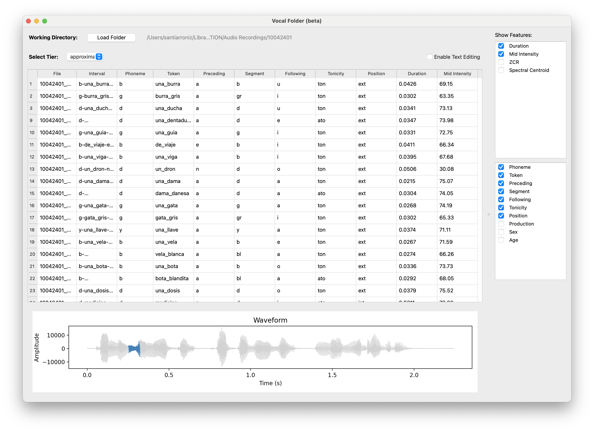

# VocalFolder

**Vocal Folder** is a desktop application built for linguists, phoneticians, and phonologists working with speech data. It offers an intuitive interface for exploring, editing, and analyzing time-aligned annotations from Praat TextGrids, fully synchronized with their corresponding audio files. Load entire folders of `.wav` + `.TextGrid` pairs, navigate annotation tiers, visualize waveforms, play individual segments, and extract key acoustic measures—all without writing code, all within a single unified window. Vocal Folder is especially useful as an intermediate step between spectrographic analysis in Praat and statistical modeling in R: it allows you to curate your data visually, filter by phonological variables or speaker metadata, and export clean, customizable datasets as R-ready CSV files.

---

## 🚩 Why Vocal Folder?

- **Multi-file & Multi-tier**  
  Load an entire directory of `.wav/TextGrid` pairs at once and instantly see every interval tier in a dropdown. Jump between tiers to compare annotation layers or speakers.

- **Rich Waveform & Playback**  
  • Full-file and segment-zoom views  
  • Click any row (or press Tab) to play that interval  
  • One-click highlight of the current segment in the waveform

- **Structured Label Parsing**  
  Automatically split hyphenated labels (e.g. `b-una_burra-fem`) into `Var1`, `Var2`, … columns—toggle each on/off, rename them (e.g. “Gender”), and seamlessly weave them into your table view.

- **On-the-fly Annotation Editing**  
  Toggle “Edit Mode” to rename files or interval labels right in the table. Unsaved edits glow yellow; saving writes back to your TextGrids (and renames `.wav`/`.TextGrid` pairs if you change filenames).

- **Flexible Filtering & Views**  
  Excel-style dropdown filters on any variable column—quickly drill down to subsets of speakers, contexts, or phonological categories. Filter status appears in the header so you never lose track.

- **Instant Acoustic Features**  
  Select which features to show in your table:
  - **Duration**  
  - **Mid-interval Intensity** (via Praat/Parselmouth)  
  - **Zero-Crossing Rate (ZCR)**  
  - **Spectral Centroid** (via Librosa)  
  - **Formant Frequencies** (F1–F3, midpoint or mean)  
  Compute and cache everything under the hood—no code, just check the boxes.

- **Export & Share**  
  Save your filtered, edited table to CSV for downstream stats, charts, or archiving.

---

## 🎯 Core Features

| Feature                        | Benefit                                                                     |
|--------------------------------|-----------------------------------------------------------------------------|
| **Bulk Folder Loader**         | Ingest hundreds of audio/TextGrid pairs in one click                       |
| **Dynamic Tier Picker**        | Work across multiple annotation tiers without re-parsing files              |
| **Waveform + Segment Zoom**    | Visualize segment boundaries and play back precise intervals               |
| **Hyphenated-Label Parsing**   | Turn structured labels into separate, toggleable columns                   |
| **Inline Annotation Editing**  | Rename labels or files safely; changes propagate back to your TextGrids    |
| **Column Filters**             | Rapidly subset by speaker, context, phonotactic category, etc.             |
| **Acoustic Feature Extraction**| Obtain duration, intensity, ZCR, spectral & formant measures instantly     |
| **CSV Export**                 | Persist your current view (including filters & edits) for analysis         |

---

## 🖼️ Screenshot

<p align="center">
  
</p>

---

## 🚀 Getting Started

1. **Clone & install**  
   ```bash
   git clone https://github.com/YOUR_USERNAME/vocal-folder.git
   cd vocal-folder
   pip install -r requirements.txt

2. **Launch app**
    ```bash
    python app/main.py

3.	**Workflow**
	- Load a folder of .wav + .TextGrid files
	- Select Tier to inspect a specific annotation layer
	- Browse & Play intervals by clicking rows or pressing Tab
	- Toggle Variables & Features in the right-hand panel
	- Filter any VarN column via right-click
	- Edit labels/files in Edit Mode
	- Export your final CSV for analysis

---

## 🔭 Roadmap
	- Batch-overlay spectrograms for entire tiers
	- Undo/redo history for table edits
	- User presets for default tiers, feature sets & filters
	- Advanced measures: spectral tilt, pitch contours, intensity range

---

## 🤝 Contributing
We welcome issues, feature requests and pull requests!
	1.	Fork the repo
	2.	Create a branch
	3.	Open a pull request with your changes

---

## License

Released under the MIT License. See LICENSE.txt for details.